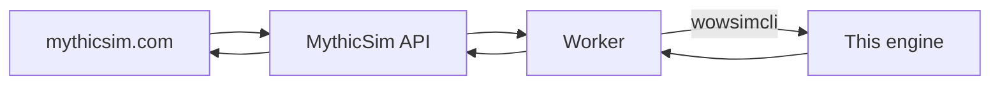

# WoW Forever Simulator

The simulation engine behind [MythicSim](https://mythicsim.com/wow-forever), kept as an open fork of the WoW Forever sim. It models every class and spec for World of Warcraft: Forever, with the beta client data as the source of truth.

Anyone is welcome to contribute. Found a spell that does the wrong damage, a missing item, a talent that doesn't work? Open an issue or send a PR. Questions or ideas, [come say hi on Discord](https://discord.gg/9c3EnKJcDK).

[Sim your character on MythicSim](https://mythicsim.com/wow-forever) · [Join the Discord](https://discord.gg/9c3EnKJcDK)

## How it fits together

MythicSim runs this engine as a separate `wowsimcli` process. You can also build and run it yourself, see below.

## Running it locally

You need Go, protobuf and Node. The `makefile` has the build, test and UI targets.

## Contributing

1. Fork the repo and branch off the most recently updated `mythicsim/*` branch.
2. Make the change and add a test where you can.
3. Open a PR and say where the numbers come from (client data, a log, a spell tooltip).

Docs worth reading first:

- [Forever rule changes](docs/forever_rules.md)
- [Where upstream is heading](docs/upstream_alignment.md)
- [Fork notes and talent data pipeline](docs/fork-notes.md)

We keep our patch set small. Anything upstream already covers gets dropped from here, and fixes we make go back upstream where they fit.

## Credits and license

MIT, same as upstream. This is a fork of [ElliotWood/Forever](https://github.com/ElliotWood/Forever), which builds on the official [wowsims/forever](https://github.com/wowsims/forever) and [wowsims/classic](https://github.com/wowsims/classic). Credit to the wowsims team and every contributor there. If you build on this, please keep a visible link back to the original projects.
